[toc]

先做有答案的题目。


## UI

### UITableView相关

1. 重用机制: 离开屏幕的cell并没有释放掉，而是被加入重用池中，当请求新的cell时从重用池取出。
2. 多线程数据源同步
   1. 并发访问，数据拷贝：记录数据操作，在拷贝数据中也执行一次
   2. 串行访问

### (1)事件传递&视图响应

传递： UIApplication->UIWindow->UIView, 通过hitTest和pointinside判断，hidden、alpha、userinteractionisenable可以用来屏蔽视图传递。

响应：如果传递到的视图UIResponse相关的touchbegin、touchmove、touchend不响应，则交给父视图，如果都没有响应，则丢弃这个事件。

#### (T)UIView和CALayer？

UIView内部有一个layer成员，UIView用于事件的传递和响应，CALayer用于视图显示，这里面体现了单一职责的设计原则。

###(1)图像显示原理

总结：CPU得到位图，通过总线传给GPU渲染，然后保存到帧缓冲区，视频控制器根据信号从帧缓冲区提取内容显示到显示器。

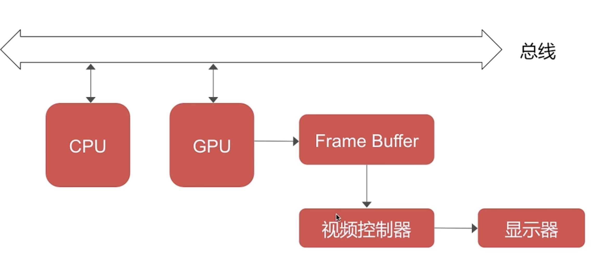

cpu和gpu

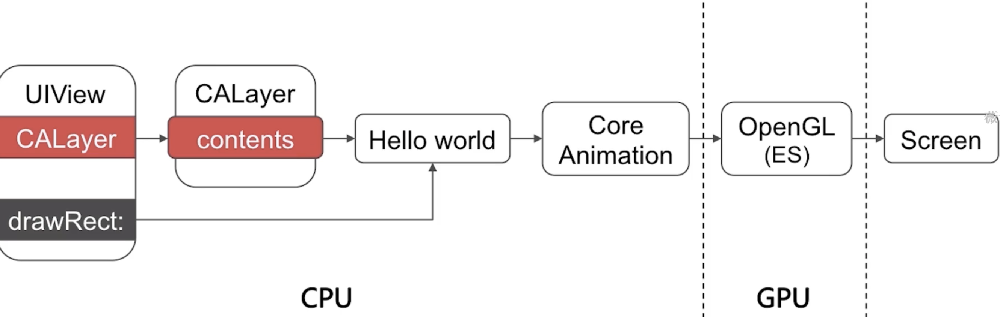

cpu

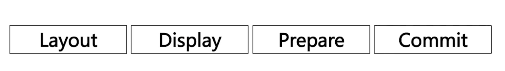

layout: 布局和文本计算

display: 绘制

prepare：图片编解码

commit：提交位图

gpu(了解)

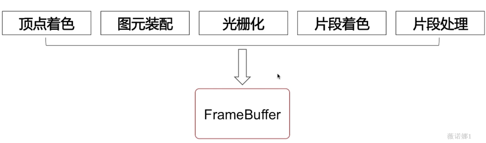


###卡顿&掉帧

60fps，即60帧每秒，即每16.7ms会有一个VSync信号

如果在信号到来时，CPU和GPU不能完成完成任务，就会掉帧。

如何优化？

1. CPU
   1. 在子线程对对象创建、修改、删除
   2. 在子线程预排版（布局和文本计算）
   3. 预渲染（文本等异步绘制，图片编解码等）
2. GPU
   1. 纹理渲染方面，减少离屏渲染，即减少layer的圆角，masktobounds，阴影蒙层
   2. 视图混合方面，简化视图层级


### 绘制原理&异步绘制

UIView绘制原理

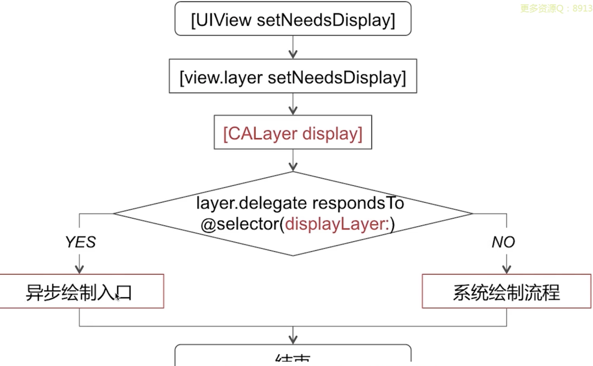

setneedsdisplay只是打上标记，display是在runloop下一个绘制周期被调用。

系统绘制流程

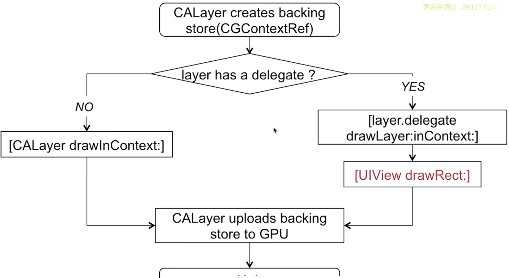

(backing store 相当于bitmap）

异步绘制流程

1. layer.delegate生成bitmap
2. 将bitmap赋给layer.contents

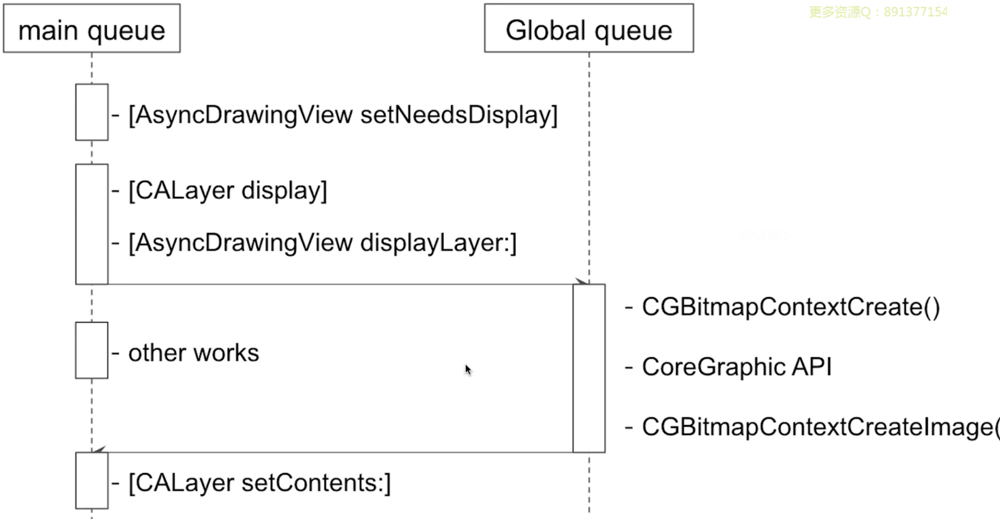


###离屏渲染

在屏渲染：GPU的渲染是在当前显示缓冲区中进行

离屏渲染：GPU在当前屏幕缓冲区以外新开辟一块空间用于渲染，在GPU面临瓶颈时，可以将一部分交给CPU完成，但是CPU的渲染能力远不如GPU高效，所以一般不推荐使用。

何时触发离屏渲染？

1. 圆角+maskToBounds
2. 图层蒙版(mask)
3. 阴影(shadow)
4. 光栅化 

为什么要避免离屏渲染？增加GPU工作量，可能会使CPU和GPU不能准时完成任务，最后产生掉帧卡顿。


###电量优化？

1. CPU和GPU
2. 定位：降低精确度，及时关闭
3. 网络：一次性下载数据，多用缓存
4. 蓝牙陀螺仪等硬件：按需使用

## OC语言特性

###分类 vs 扩展

分类

特点：

1. 运行时添加
2. 可以对系统类添加分类

作用：

1. 声明私有方法
2. 按不同的功能分解类
3. 把framework私有方法公开

可以添加：

1. 实例方法
2. 类方法
3. 属性
4. 协议

易错点：

1. 分类添加的方法可以“覆盖”原类方法
2. 同名分类方法后编译的先生效
3. 名字相同的分类会引起编译报错

扩展

特点：

1. 编译时决定
2. 只以声明形式存在，多数情况寄生于宿主类
3. 不能为系统类添加扩展

###关联对象

可以为分类添加实例变量。

关联对象的本质：

关联对象由AssociationsManager管理，对象上所有关联对象会被保存到一个AssociationMap, 然后存入一个全局的AssociationsHashMap.

主要函数： 

getAssociatedObject

setAssociatedObject

removeAssociatedObjects


关联对象不需要在dealloc释放无论ARC还是MRC都会在dealloc后自动解除关联对象。


### 代理 vs 通知

代理：

1. 代理模式
2. 一对一
3. 借助协议实现

委托者拥有weak delegate，避免循环引用。

通知：

跨层传递。

如何实现通知机制？

保存一张Map表，key为观察的notificationname，value为一个结构体包含观察的对象和回调的函数，利用观察者模式实现。

### (1)KVO & KVC

KVO：key-value observing, 观察者模式，通过isa-swizzling（动态创建新子类，重写setter方法，修改isa指针）实现。

重写的setter方法：

```
- (void)setValue:(NSString *)value {
	[self willChangeValueForKey: @"value"];
	_value = value;
	[self didChangeValueForKey: @"value"];
}
```

KVC：key-value coding，键值编码。

valueForKey

setValue:forKey

可以通过KVC访问私有方法，会破坏面向对象。

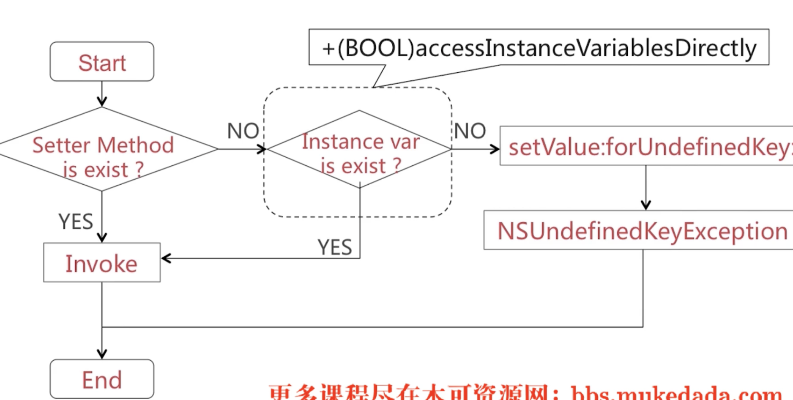

1. 判断getter或setter方法是否存在
2. 如果没有实现accessInstanceVariablesDirectly, 则判断实例变量(key, _key)或相似的实例变量( _isKey, _isKey)是否存在
3. 调用get或set的undefinedkey函数

###(1)属性关键字

1. 读写: readwrite(default), readonly
2. 原子: atomic(default, get, set线程安全，但是对数组的add，remove等不保证线程安全), nonatomic
3. 引用计数: strong/retain, assign/unsafe_unretained, weak, copy

assign vs weak:

1. assign可以用于基本类型， weak只用于OC对象

2. assign和weak不改变引用计数

3. assign可能产生悬挂指针，weak释放自动置为nil

怎么用copy？

1. NSString, NSArray, NSDictionary等因为有对应的Mutable类型，经常用copy。
2. block用copy，block原来在栈区通过copy拷到堆区。

浅拷贝 vs 深拷贝？

1. 浅拷贝增加引用计数，指向同一块地址
2. 深拷贝不会增加引用计数，指向新开辟的内容相同的内存空间

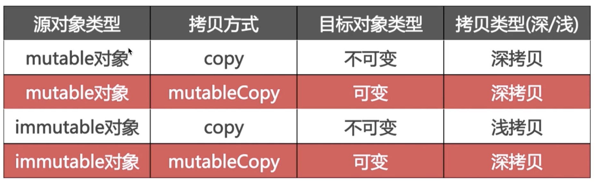


MRC下retain修饰setter方法？

```
@property (nonatomic, retain) id obj;
- (void)setObj:(id)obj {
	if (_obj != obj) {
		[_obj release];
		_obj = [_obj retain];
	}
}
```


id vs instancetype?

1. id在编译时不知道真实类型，instancetype知道，可以让编译器报警告。
2. id还可以定义变量，instancetype只能用做返回值类型。

copy？

* 怎么用copy关键字？

  1. block使用copy

  2. NSString，NSArry， NSDictionary等使用copy

     因为NSString, NSArray, NSDictionary都有对应的可变类型NSMutableString, NSMutableArray, NSMutableDictionary，copy可以生一份不可修改的备份，防止被修改

* 如何让自己的类用copy修饰？如何重写带copy关键字的setter？


## Runtime

### (1)数据结构

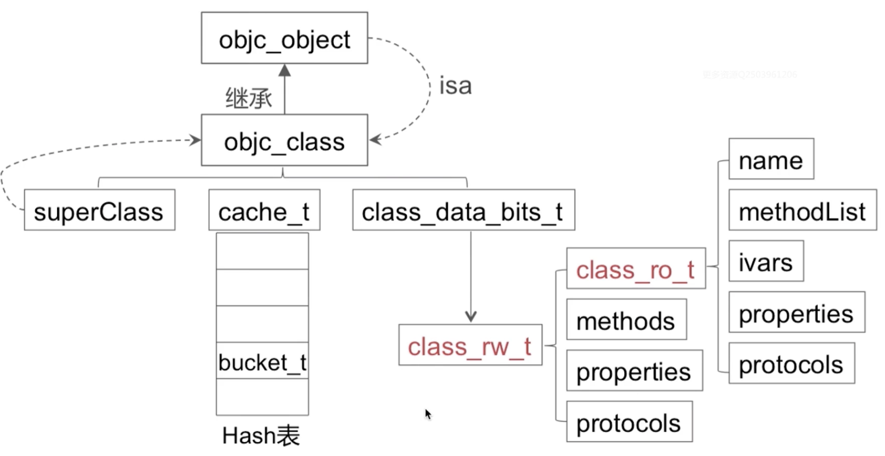

id = objc_object

1. isa_t
2. 关于isa操作相关
3. 弱引用相关
4. 关联对象相关
5. 内存管理相关

Class = objc_class(继承自objc_object)

1. superClass: Class
2. cache: cache_t(方法缓存)
3. bits：class_data_bits_t(类基本信息，包括原有和分类的属性、实例、方法)

isa

1. 指针型isa
2. 非指针型isa（部分代表Class地址）

isa指向：

实例->Class->MetaClass

cache_t（保存SEL和IMP）

1. 用于快速查找方法
2. 是可增量的哈希表（查找更快）
3. 应用局部性原理（只有部分方法被频繁使用）

class_data_bits_t是class_rw_t的封装

class_rw_t（可读可写，保存原有+分类方法、属性等）

1. class_ro_t
2. protocols(二维数组)
3. properties（二维数组）
4. methods（二维数组）

class_ro_t（只读, 保存原有方法、属性等）:

1. name(类名)
2. ivars（实例变量， 一维数组）
3. properties（一维数组）
4. protocols（一维数组）
5. methodlist（一维数组）

method_t

1. SEL name 方法名称
2. const char* types 方法返回值和参数类型
3. IMP imp  函数体

const char* types

返回值 + 参数1 + ...(第一，第二个参数固定@：，表示self的id类型和方法的SEL类型)

### (1)类对象与元类对象

类对象和元类对象类型都是objc_class,

1. 类对象存储实例成员、方法
2. 元类对象存储类成员、方法

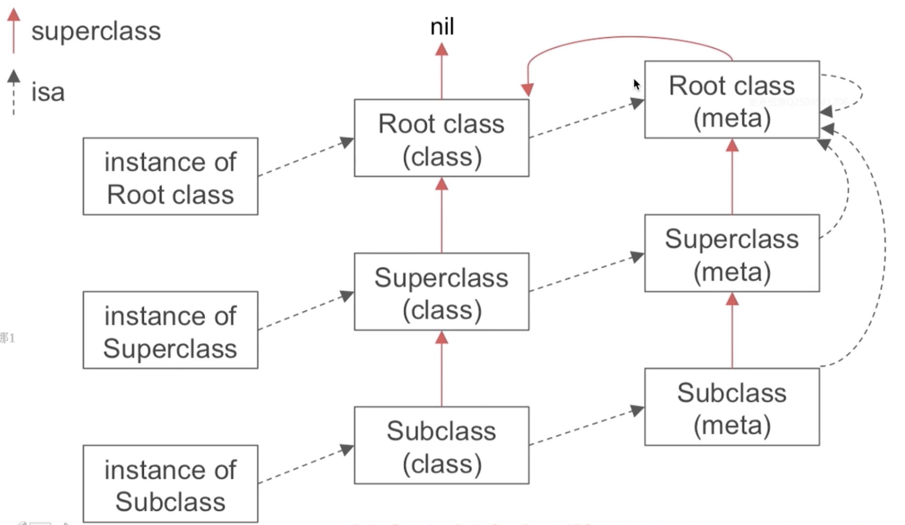

实例方法查找过程：

1. 类对象中寻找
2. 逐级往上，直到nil

类方法查找过程：

1. 元类对象中寻找
2. 逐级往上
3. 在根类对象寻找，如果还没有，返回nil

objc对象的内存布局？（非TaggedPointer对象）

1. isa指针
2. 所有父类和自己的实例变量

###(1)消息传递

objc_msgSend 消息传递，

_objc_msgForward 消息转发。

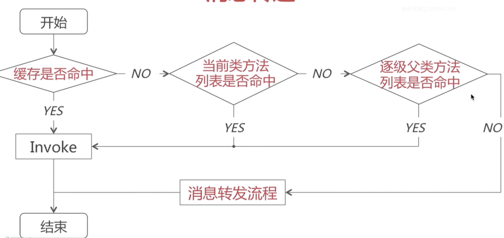


####以下代码，输出什么？

```
@interface Phone: Mobile
@end
@implementation Phone
-(id)init {
	self = [super init];
	if(self) {
		NSLog(@"%@", NSStringFromClass([self class]));
		NSLog(@"%@", NSStringFromClass([super class]));
	}
}
```

答案：

Phone 

Phone

原因：
```
[self class] -> objc_msgSend(self, @selector(class))
[super class] ->objc_msgSendSuper(super, selector(class))

struct objc_super {
	__unsafe_unretained id receiver;
}

```
super只是从父类开始查，最后还是在NSObject中找到class方法，因为super的receiver还是self，所以返回phone

###方法缓存

1. 通过SEL去cache的哈希表中查找，如果没有
2. 在当前类中查找，如果方法列表是排序好的，用二分法查找，如果未排序，遍历，如果没有
3. 通过superclass，逐级查找，如果没有返回nil

### 消息转发

1. +resolveInstanceMethod, 动态添加方法，消息会被重新发送。
2. fast转发给其他对象
3. normal转发，先通过methodSignatureForSelector判断函数参数和返回值，然后通过forwardInvocation转发给目标对象。

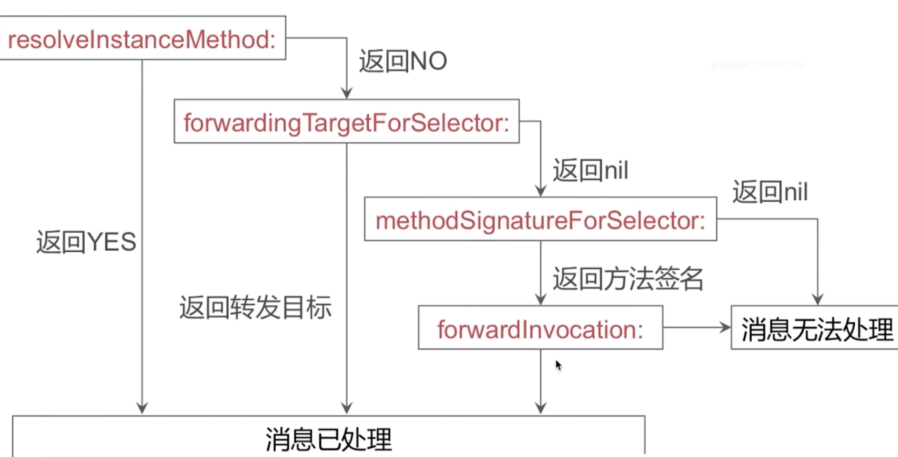


### method-swizzling

交换方法实现。

exchangeImplementations

### 动态添加

动态添加类

objc_allocateClassPair

往动态类里添加实例变量

class_addIvar

往动态类添加实例方法

class_addMethod


###动态方法解析

@dynamic

运行时语言

编译时语言

## Memory

###(1)内存布局

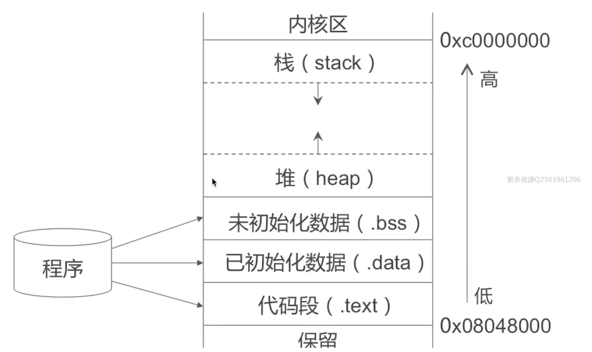

stack: 方法调用

heap：alloc等分配的对象

bss：未初始化的全局和静态变量

data：已初始化的全局和静态变量

### (1)内存管理方案

1. TaggedPointer(适用于number等小对象， 没有isa，本身即是实际值+一些信息)
2. NONPOINTER_ISA（优化的isa指针，保存更多信息）
3. 散列表（当isa的extra_rc不足以保存时，会保存到引用计数表）


NONPOINTER_ISA

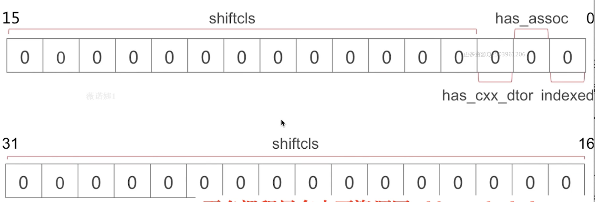

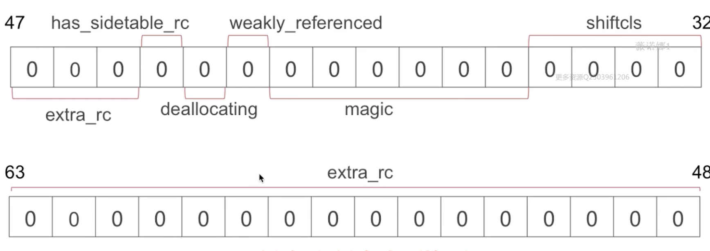

散列表

sidetables：hash表，value为sidetable，通过对象找到对象所属的sidetable

sidetable包含：

1. 自旋锁：忙等锁，适合轻量访问
2. 引用计数表：hash表，value结构：

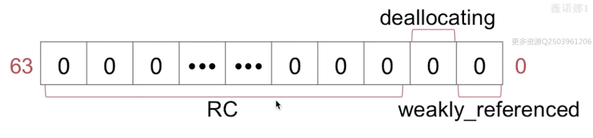

3. 弱引用表：hash表

   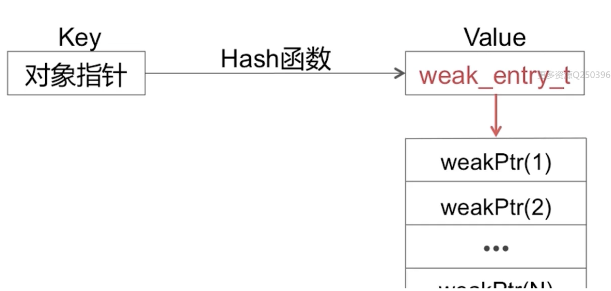

### ARC & MRC

 MRC：手动管理，alloc, dealloc, **retain, release, retainCount, autorelease**

ARC: 自动管理，编译器和runtime协作，不能使用手动管理关键词，增加weak,strong关键词


ARC通过什么方式帮助管理内存？

在编译期，在底层接口实现retain/release/autorelease； 在运行期，通过weak自动释放等管理内存。

### 引用计数

retainCount = 存在数据结构中的引用计数+1， 所以尽管alloc不调用retain，retainCount=1.

dealloc内部实现

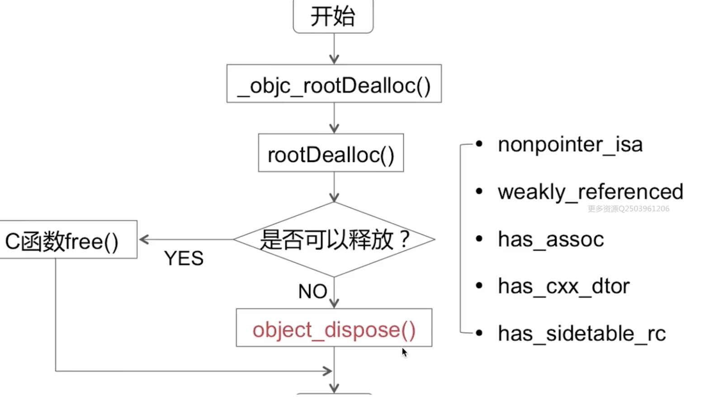

### (1)弱引用

添加weak变量过程

id __weak a = b -> objc_initWeak(&a, b) ->storeWeak ->weak_register_no_lock

在register函数中，会通过hash查找对象b的弱引用表，如果对象b weak表为空，创建一张新表，使第一个元素为指针a，其余为nil，不为空，直接添加新元素。

清除weak变量，指针置为nil过程

dealloc ->... ->weak_clear_no_lock

在clear中，会通过hash查找当前对象对应的弱引用表，然后遍历，如果找到指针，置为nil。

### 自动释放池

>App启动后，苹果在主线程 RunLoop 里注册了两个 Observer，其回调都是 _wrapRunLoopWithAutoreleasePoolHandler()。
>
>第一个 Observer 监视的事件是 Entry(即将进入Loop)，其回调内会调用 _objc_autoreleasePoolPush() 创建自动释放池。其 order 是-2147483647，优先级最高，保证创建释放池发生在其他所有回调之前。
>
>第二个 Observer 监视了两个事件： BeforeWaiting(准备进入休眠) 时调用_objc_autoreleasePoolPop() 和 _objc_autoreleasePoolPush() 释放旧的池并创建新池；Exit(即将退出Loop) 时调用 _objc_autoreleasePoolPop() 来释放自动释放池。这个 Observer 的 order 是 2147483647，优先级最低，保证其释放池子发生在其他所有回调之后。

autoreleasepool是一张双向链表，每一个结点是autoreleasepoolpage，每次push先判断栈是否满，未满，插入一个哨兵，返回哨兵地址，然后添加对象，满则插入一个新page，每次pop，把到哨兵前的对象release。

不同的线程有不同的autoreleasepool。

### 循环引用

形成一个圈，分成：自循环，相互循环和多循环。

打破循环引用方法：

1. 避免循环引用
2. 在合适的时机手动断开环

因为timer会被runloop强引用，所以可以在NSTimer和vc间增加中间对象，在每次触发定时器时判断如果vc释放，则释放timer。


objc使用什么机制管理对象内存？

引用计数，每次runloop运行的时候，都会check retaincount，如果为零，则释放。

## Block

### (1)什么是block

block是将函数及其上下文封装起来的对象。

### 截获变量

1. 局部变量：基本数据类型截获值，对象类型连同所有权修饰符截获。
2. 静态局部变量：指针形式截获。
3. 全局变量：不截获。
4. 静态全局变量：不截获。

###__block修饰符

1. 对局部变量无论基本类型还是对象类型赋值都需要__block.
2. 对静态局部、全局、静态全局变量赋值都不需要__block。

__block修饰的变量变成了__struct对象, 地址被传入block。

###block内存管理

什么时候发生copy：

1. 显示调用copy
2. block作为函数返回值
3. block被赋值给id成员变量或__strong修饰的block成员
4. 作为系统方法usingblock的参数或GCD参数

对不同类型block作copy操作：

1. Global，copy什么不做
2. Stack， copy to heap
3. Malloc, copy增加引用计数

__forwarding在未copy时指向栈上的block变量，copy后不论栈或是堆的forwarding都指向堆上的block对象。

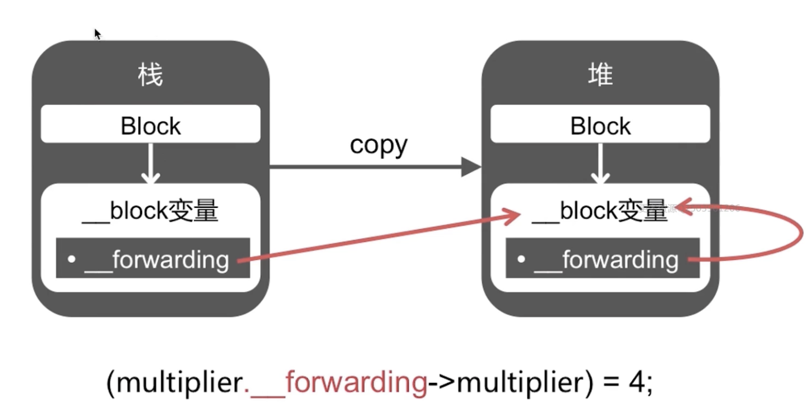

###(1)block的循环引用

解决循环引用两个方法：

1. 手动断开
2. weak


```
_blk = ^{NSLog(@"self = %@", self);};
```

问题：循环引用，堆上的block对self强引用，self对block成员强引用。

修改方法：block内容实用weak self。

## 多线程

### GCD

dispatch_set_target_queue: 1. 修改优先级 2. 创建层级结构。

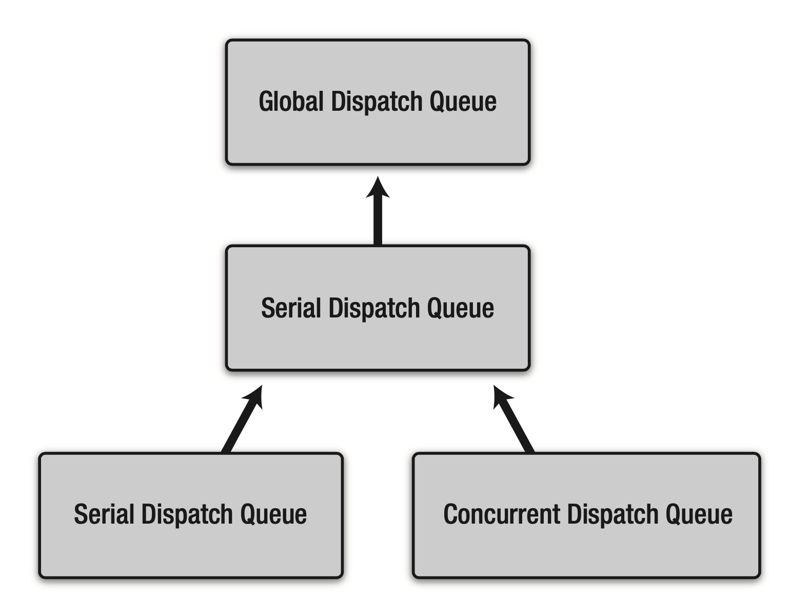 

dispatch_after: 到时间block被加入queue， 另外timer基于runloop，所以会有runloop没开不运行，mode不对不运行等问题，after则没有这些问题。

dispatch_group: dispatch_group_notify or dispatch_group_wait

dispatch_barrier_async

dispatch_apply：多次添加同一task

dispatch_suspend/dispatch_resume：只阻止尚未开始的task。

dispatch_semaphore: 信号量大于0进入，否则等待

dispatch_once

dispatch I/O

dispatch_source: 可以cancel。

gcd是在系统层对线程管理。


一般用于简单的数据同步或多读单写。

同步/异步 和 串行/并发

performSelector:afterDelay要求当前线程有runloop正在运行，否则不执行。

dispatch_barrier_async

 dispatch_group_async

### NSOperation

基于GCD。

优势特点：

1. 添加任务依赖
2. 任务执行状态控制：isReady, isExecuting, isFinished, isCancelled
3. 最大并发量

怎样控制状态？

1. 如果只重写main方法，底层控制变更任务执行状态
2. 如果重写了start方法，自行控制任务状态

状态变更会用到KVO。

### NSThread

用于实现常驻线程。

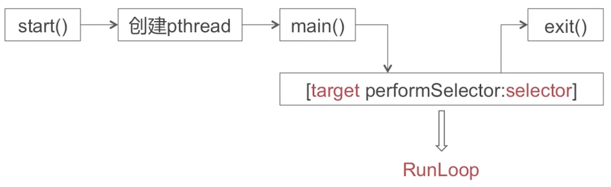

###多线程与锁

锁：

1. @synchronized: 创建单例对象使用
2. atomic： 修饰属性关键字，保证赋值安全，不保证使用安全
3. OSSpinLock：自旋锁，忙等，用于轻量级访问如int +1/-1
4. NSRecursiveLock：递归锁，可以重复lock
5. NSLock: 互斥锁
6. dispatch_semaphore_t：信号量
   1. dispatch_semaphore_create: 
   2. dispatch_semaphore_wait: -1, 如果<0,当前线程主动阻塞
   3. dispatch_semaphore_signal：+1, 如果<=0, 被动唤醒，由释放的线程唤醒阻塞线程

#### 多线程？

#### block?循环引用？

## RunLoop

### 概念

内部维护事件循环对事件/消息管理的对象。

事件循环： 没有消息休眠（用户态->内核态），有消息立刻唤醒（内核态->用户态）

之所以可以休眠而不是死循环，是由于run会调用系统的mach_msg(), 切换到内核态，

之所以唤醒，是由于mach_msg在一定条件(source1等), 会唤醒runloop，返回用户态

### 数据结构

1. CFRunLoop
2. CFRunLoopMode
3. souce/timer/observer: source0触摸事件，source1 port事件

### (1)事件循环机制

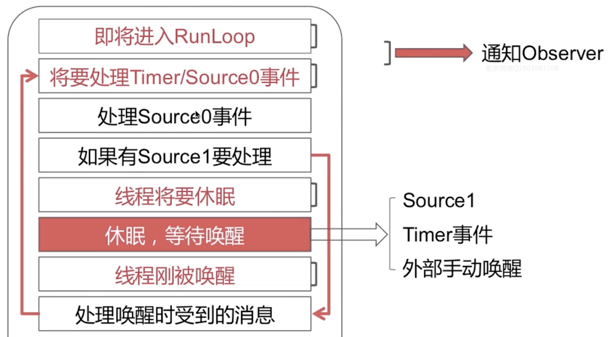

### RunLoop与NSTimer

苹果mode name:

1. defaultmode
2. uitrackingmode
3. commonmode

将defaultmode和uitrackingmode加入runloop的commonmode（系统预置），timer加入commonmodeitems，timer会自动同步到各个commonmode下，可以使timer在多个mode下运行。

###RunLoop与多线程

1. 一一对应
2. 主线程自动开启，非主线程手动开启


点击图标，程序启动，运行，到程序被杀死，内部过程？

1. runloop开启：main函数运行，内部会调用UIApplicationMain，在这里面会启动主线程的runloop
2. runloop运行：经过一系列的处理，runloop休眠，如果这时我们点击主屏幕，会产生MachPort，然后转化成source1，把主线程唤醒，处理事件
3. runloop结束：当程序被杀死，进入runloop的退出，observer会接收到通知，runloop关闭后，线程被销毁

如何实现一个常驻线程？

1. 为当前线程开启一个runloop
2. 向runloop中添加一个port/source等维持runloop事件循环
3. 启动runloop

runloop mode的作用？

model主要用来指定事件在运行循环中的优先级。


卡顿检测？

添加observer到runloop的common mode，通过各个阶段的运行时间，判断卡顿位置。

##网络

###http协议

request和reponse格式

1. request: 请求行， 消息头， 消息体
2. response：状态行，消息头，消息体

request类型：get, post, head, put, delete, options

get vs post

1. get用于获取资源，post用于处理资源
2. get请求参数在url，post在body
3. get参数有限制，post没有限制
4. get请求不安全，post安全

状态码

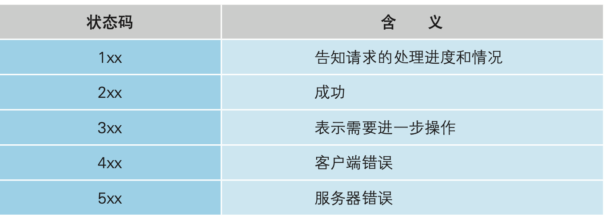

建立连接

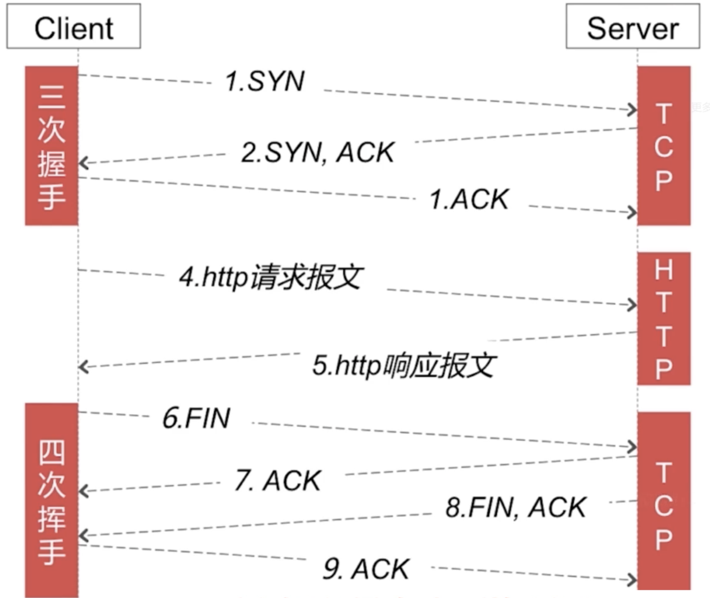

http特点

1. 无连接 -> http持久连接，头部字段：（Connection： keep-alive, time: 20(多少时间), max: 10（多少条请求）)
2. 无状态 -> Cookie/Session

###https与网络安全

https = http + ssl/tls

https连接流程

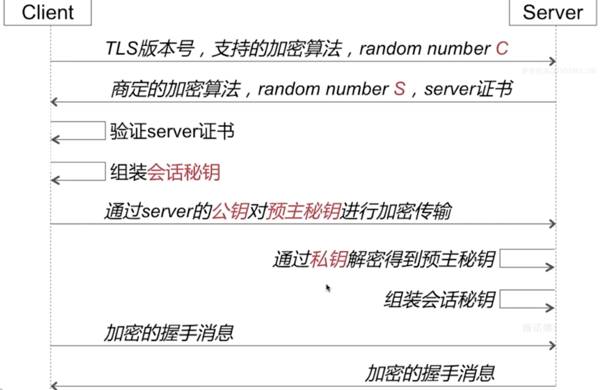


###tcp/udp

传输层。

udp特点:

1. 无连接
2. 不保证可靠
3. 面向报文：不合并不拆分


复用、分用

差错检测


tcp特点：

1. 面向连接
2. 可靠
3. 面向字节流
4. 流量控制
5. 拥塞控制 

###dns解析

###session/cookie


#### get和post？

1. get获取，post提交
2. get无请求体，post有
3. get暴露请求，post安全
4. get url长度有限，post长度不受限制

如何判断请求结束？

1. Content-length
2. chunked，最后一个package是空的chunked

charles抓包原理？

中间人攻击。

## 设计模式

#### 原则

1. 单一职责：一个类只负责一件事
2. 开闭：扩展开放修改关闭
3. 依赖倒置：依赖抽象不依赖具体
4. 最少知道：尽量少与其他类交互，高内聚，低耦合
5. 接口隔离：使用 多个专门协议比单协议好
6. 替换：基类出现的地方子类一定可以出现


###责任链

调用方法时，像链表一样传递下去，每一个节点基类相同只处理自己相关的事务。

```
class A {
	A *next;
	
	Process() {
		block = {
			next->Process();
		}
		handle(block)
	}
	
	handle(returnBlock) {...}
}
```

### 桥接

桥梁作用，用抽象代替具体。

```
class BaseA {
	BaseB *obj;
}
```

###适配器

转换接口。

```
class A{
	B *b;
	methodA() {
		// 额外操作
		b->methodB();
	}
}
```

###单例

只有一个实例，懒汉和饿汉。

```
class Single {
	+ (id)sharedInstance {
		static Single *instance = nil;
		static dispatch_once_t onceToken;
		dispatch_once(&onceToken, ^{
			instance = [[super allocWithZone: NULL] init];
		}
		return instance;
	}
	
	+ (id)allocWithZone:(struct _NSZone*)zone {
		return [self sharedInstance];
	}
	
	- (id)copyWithZone:(struct _NSZone*)zone {
		return self;
	}
}
```

###命令

将请求封装成对象，支持cancel。

###策略

一个方法有多种实现，对于不同的类型可以用不同的实现。

###工厂

封装类的实例化。

简单工厂：没有子类，通过参数决定实例化的类。

工厂：子类决定实例化的类。

抽象工厂：包含多个接口，每个接口创建一个实例类。

###状态

内部状态改变时，切换状态对象。

###观察者

特点：一对多，松耦合。

描述：注册成为某个主题的观察者，当主题的状态变化，通知所有观察者。

###代理

委托他人实现具体方法。

### 迭代器

封装聚合顺序访问内部实现。

### 组合

集合对象和个别对象继承同一个父类。

### 外观

提供统一接口。

###模版

父类创建算法模版，子类通过继承修改某些方法实现。

### 装饰者

通过装饰者动态给原有对象添加新的功能，装饰者和原有对象类型相同。

## 架构

目的

1. 模块化

2. 分层

3. 解耦

4. 降低代码重合度


###图片缓存？

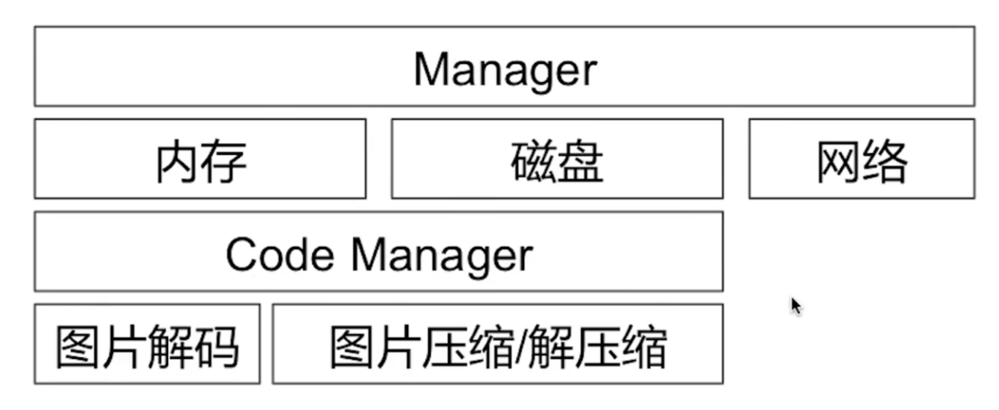

1. 内存读取，有，返回，没有
2. 磁盘读取，有，存到内存，返回，没有
3. 请求网络，存到内存，返回


内存模块需要考虑：

1. size：e.g 10kb * 100, 50kb * 20, 100kb * 10...
2. 淘汰策略
   1. 队列，先进先出
   2. LRU：可以在读写和前后台切换时check存在时间，超过多长时间未使用就删除

磁盘需要考虑：

1. size
2. 淘汰策略
3. 存储方式

网络需要考虑：

1. 最大并发
2. 超时策略
3. 优先级

图片解码需要考虑：可以用策略模式实现对不同种类的图片格式的解码。

解码应该在图片从磁盘取出或网络返回后。


###阅读时长统计？

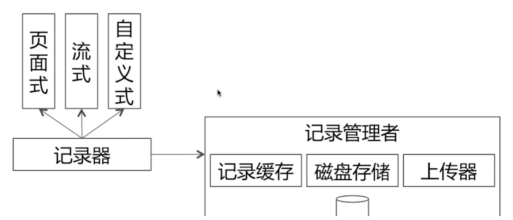

为什么有不同记录器？适配不同场景。

如何处理数据丢失？

1. 定时写磁盘
2. 定量写磁盘

上传？

1. 立刻上传
2. 延时上传
   1. 前后台切换
   2. 从无网到有网变化
3. 定时上传

#### MVVM？

view（view和viewcontroller）只和viewmodel交互，view包含viewmodel强引用成员，viewmodel通过block回调view，model只和viewmodel交互，viewmodel有model强引用成员，model通过block或delegate回调viewmodel。

RN原理？

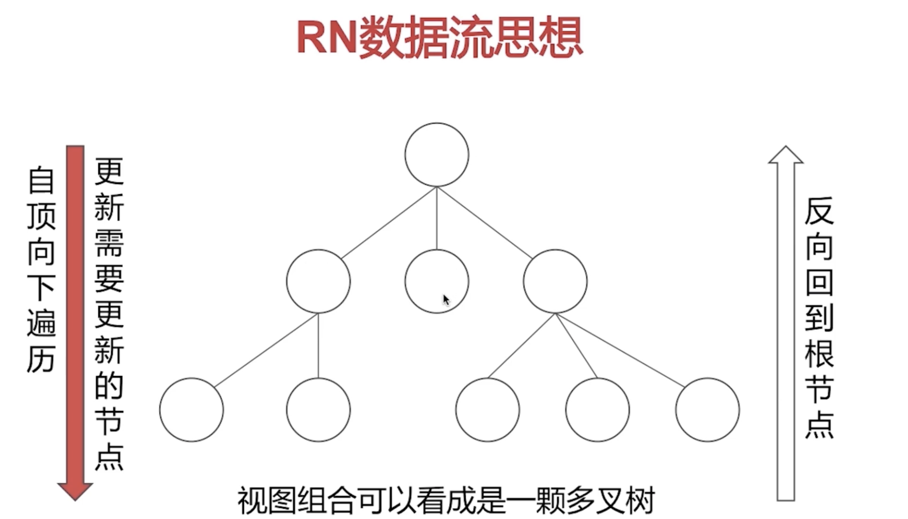

客户端整体架构？

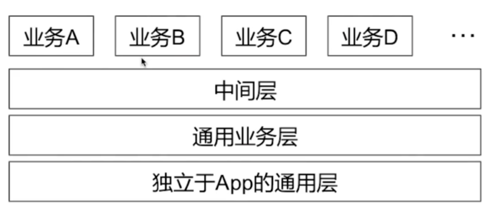

中间层用于解耦业务逻辑。

业务间的解耦方式：

1. openURL
2. 依赖注入（业务对其他业务的依赖通过外部注入，实现解耦）


SkyDRM 架构？

client层：UI， DownloadManger, UploadManager, RenderManager

业务层：User(usermanager, user, preference), cloud(cloudmanager, repositorymanager...), token(tokenmanger), log(logmanager)

通用业务层：RestAPI(command: query, response), cache(coredata, keychain, plist manager)

通用层： Alamofire， core


###组件化？

目的：解耦，复用，方便管理。

按照基础组件、功能组件、业务组件将项目拆分成多个子项目， 业务组件可以依赖基础组件和功能组件， 业务组件和业务组件之间通过中间层解耦，中间层通过router访问组件最后形成组件对中间层的单向依赖。

##算法

字符串反转？

链表反转？

有序数组合并？

Hash算法？

查找两个子视图的共同父视图？

求无序数的中位数？


递归与迭代？


## 第三方库

### Alamofire?

核心类：SessionManager, SessionDelegate, Request, TaskDelegate

多线程：GCD， OperationQueue

SessionManager的单例default设置SessionDelegate为URLSession的delegate。

当发起一个请求时，SessionManager会创建URLSessionTask， 创建request，设置它的task为URLSessionTask，初始化它的taskdelegate，并且sessiondelegate保存task到request的映射。

当通过链式表达式加入response block会被保存到taskdelegate的queue中，这个queue一开始是挂起的，加入validate会被保存到request的validataions。

当session 回调回来时，判断是否有用户自定义的block回调，没有则通过delegate保存的task到request的映射回调到taskdelegate。

当complete回调返回时，先执行所有的validations，如果失败则保存error到request，当回调到taskdelegate，如果有error则结束，如果没有，不再挂起queue，response将responseData通过block回调。

### SDWebImage?

1. 扩展UIImageView和UIButton
2. 主要类：SDWebImageManage管理dowload和cache，SDWebImageDownloader下载图片和SDWebImageCache管理缓存
3. 下载图片，如果内存有，从内存取，没有从磁盘取，放入内存，没有通过网络下载图片。

如何设计图片缓存参考架构-图片缓存。

### JSBridge?

JS通过Iframe，加载url，触发native webview代理，native调用api后回调JS方法。


